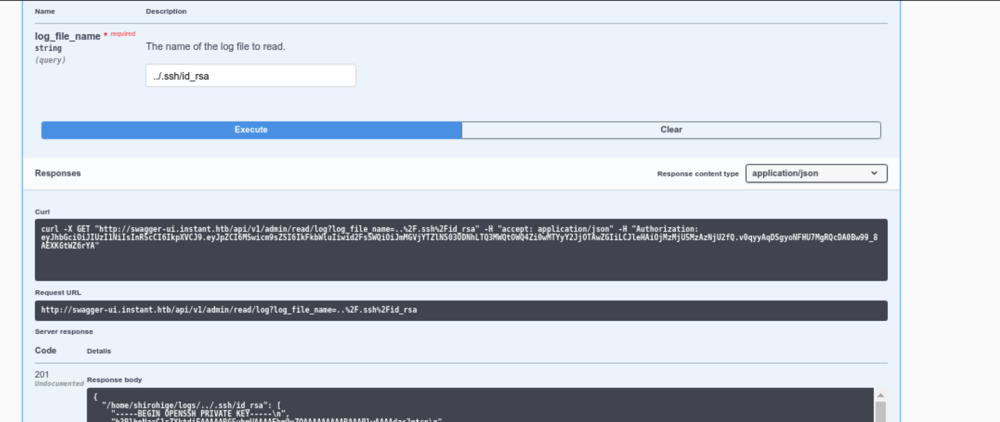
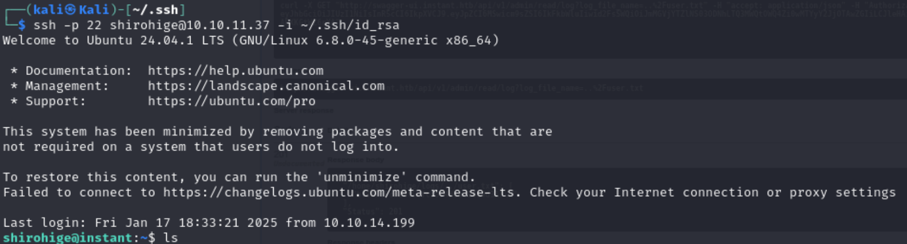
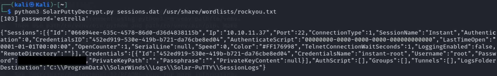

## Reconssinance and enumeration
``nmap -sC -sV --min-rate 10.10.11.37``
- Found 22 and 80 port open
- Found hostname to be instant.htb
- Added it to hosts

## User Flag
- Download apk
- Install Jdax to read the conttent  of apk
- rread content of apk and output it to a directory ``jadx -d ~/output_apk ~/Downloads/instant.apk``
- Explore arounfd the directories we find com directory in sources read Admin activity under itt
-- We see a JWT token to site ``mywallet1.instant.htb`` subdomain and adding it to hosts
- Again exploring areounf resources we find XML under which we find ``swagger-ui.instant.htb``
- Authorizing the swager ui with JWT we got earlier
- We are able to see the users
```Json
{
  "Status": 200,
  "Users": [
    {
      "email": "admin@instant.htb",
      "role": "Admin",
      "secret_pin": 87348,
      "status": "active",
      "username": "instantAdmin",
      "wallet_id": "f0eca6e5-783a-471d-9d8f-0162cbc900db"
    },
    {
      "email": "shirohige@instant.htb",
      "role": "instantian",
      "secret_pin": 42845,
      "status": "active",
      "username": "shirohige",
      "wallet_id": "458715c9-b15e-467b-8a3d-97bc3fcf3c11"
    }
  ]
}
```
- In swagger-ui send request to view log ``1.log`` replace this with ``../../../../etc/passwd`` and ``../.ssh/id_rsa`` or we can directlly get userflag by sending request ``../user.txt`` 

- But we need rssa public key to login to user shirohige


## Root Flag
- Explore around the host we find ``/projects/mywaalleet/Instant-Api/mywallet/instaance/instant.db``
- Use sftp to get instant.db on a new terminal use following ``sftp -i ~/.ssh/id_rsa shirohige@10.10.11.37``
- We are in sftp sheell, to download instant use following ``get /projects/mywallet/Instant-Api/mywallet/instance/instant.db /home/kali/``
- Open it we find pbkdf2:sha256 encrypted password
- Just google where backups are uually stored and found they are stored usually in ``/var/`` or ``/opt/``
- Found sessions.dat in ``/opt/backups/Solar-PuTTY/sesssions.dat`` which seemed to contain details of database.
- Gooogled for solar putty decrypt and found a python program to decrypt using Solar-Putty 

- Saved both SolarPutty.py and sessions.dat in local directory and decrypted

- Login to root using ``su root`` using the password